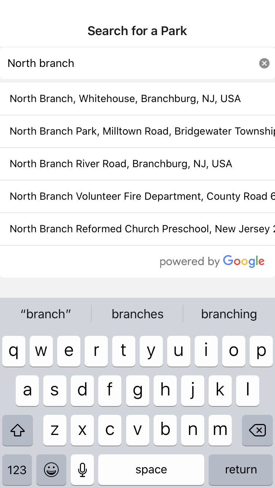
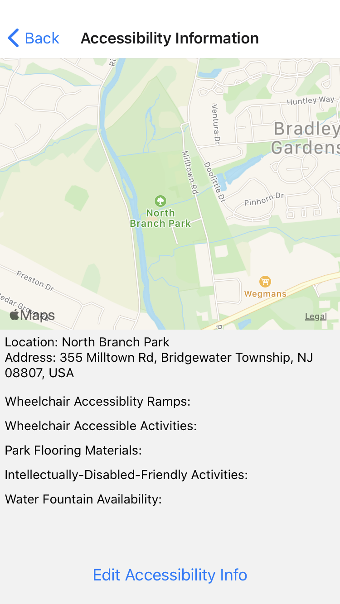
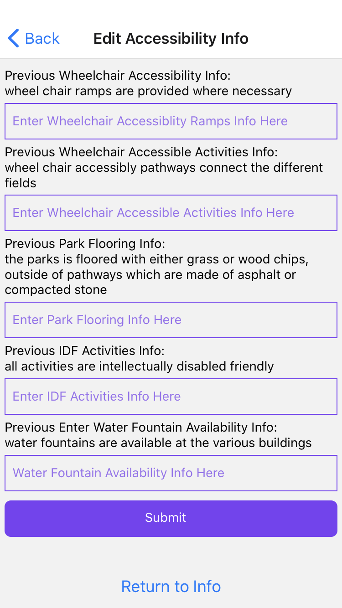
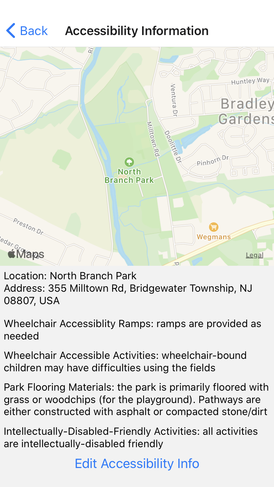

# park-accessibility-app
 
# This app is designed to allow parents to search for information about the various parks in their local area and learn more about the facilities provided by each to maintain accessibility. The current build involves wheelchair accessiblity and intellectually-disabled accessibility. Information on running the project is provided at the bottom of this page.

# When openning the project, you will be greeted by a blank page with a search bar. You can use this search bar to find and select a location, which will bring you to the Accessibility Information Screen.

# The Accessibility Information Screen will provide you with information about the location, including an interactable map, the location's name and address, and various categories of accessiblity information. If these are not filled out, as below, they can be filled out by a volunteer who chooses to visit the park and add information through the Edit Accessibility Info Screen.

# On this page, you can add/edit information present in the database. Any edits can be seen once the Accessiblity Information Screen is updated, and prior information/newly added information will be visible on the Edit screen itself.

